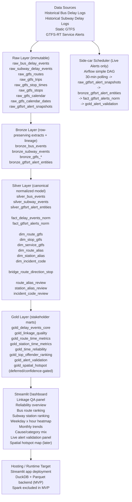

# TTC PULSE

Final MVP architecture for analytics and visualization of TTC delay reliability using a DuckDB + Parquet backend and a Streamlit frontend.

## Final MVP Architecture (Tweaked)

## Layer Inventory

### Data Sources
- Historical Bus Delay Logs
- Historical Subway Delay Logs
- Static GTFS
- GTFS-RT Service Alerts

### Raw Layer (immutable)
- `raw_bus_delay_events`
- `raw_subway_delay_events`
- `raw_gtfs_routes`
- `raw_gtfs_trips`
- `raw_gtfs_stop_times`
- `raw_gtfs_stops`
- `raw_gtfs_calendar`
- `raw_gtfs_calendar_dates`
- `raw_gtfsrt_alert_snapshots`

### Bronze Layer (row-preserving extracts + lineage)
- `bronze_bus_events`
- `bronze_subway_events`
- `bronze_gtfs_*`
- `bronze_gtfsrt_alert_entities`

### Silver Layer (canonical normalized model)
- Core silver tables:
  - `silver_bus_events`
  - `silver_subway_events`
  - `silver_gtfsrt_alert_entities`
- Canonical facts:
  - `fact_delay_events_norm`
  - `fact_gtfsrt_alerts_norm`
- Dimensions and alias tables:
  - `dim_route_gtfs`
  - `dim_stop_gtfs`
  - `dim_service_gtfs`
  - `dim_route_alias`
  - `dim_station_alias`
  - `dim_incident_code`
- Bridge:
  - `bridge_route_direction_stop`
- Review/QA:
  - `route_alias_review`
  - `station_alias_review`
  - `incident_code_review`

### Gold Layer (stakeholder marts)
- `gold_delay_events_core`
- `gold_linkage_quality`
- `gold_route_time_metrics`
- `gold_station_time_metrics`
- `gold_time_reliability`
- `gold_top_offender_ranking`
- `gold_alert_validation`
- `gold_spatial_hotspot` (deferred / confidence-gated)

## Dashboard Scope (MVP)
- Linkage QA panel
- Reliability overview
- Bus route ranking
- Subway station ranking
- Weekday x hour heatmap
- Monthly trends
- Cause/category mix
- Live alert validation panel
- Spatial hotspot map (later)

## Runtime + Orchestration
- Streamlit app deployment
- DuckDB + Parquet backend
- Spark excluded from MVP
- Side-car Airflow DAG only for GTFS-RT live alerts:
  - 30-minute polling cadence
  - `raw_gtfsrt_alert_snapshots`
  - `bronze_gtfsrt_alert_entities`
  - `fact_gtfsrt_alerts_norm`
  - `gold_alert_validation`
