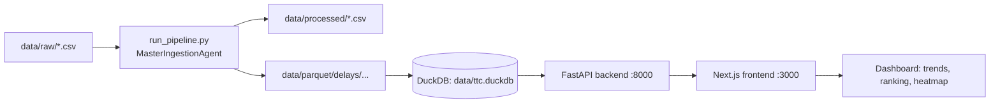

# TTC Delay Analytics

End-to-end local analytics stack for TTC delay data:

- **Ingestion pipeline** normalizes raw CSV drops into cleaned outputs and partitioned Parquet.
- **DuckDB analytical layer** exposes performant views over Parquet data.
- **FastAPI backend** serves query endpoints from DuckDB.
- **Next.js frontend** renders an interactive dashboard.

---

## System Diagram



---

## Setup

### 1) Install backend

```bash
cd backend
python3 -m venv .venv
source .venv/bin/activate
pip install --upgrade pip
pip install -r requirements.txt
cd ..
```

### 2) Install frontend

```bash
cd frontend
npm install
cd ..
```

### 3) Configure environment

```bash
cp .env.example .env
```

Defaults are safe for local development (`backend:8000`, `frontend:3000`, `data/ttc.duckdb`).

---

## Run (End-to-End)

1. **Place data in `data/raw/`**
   - Expected folders include:
     - `data/raw/bus/*.csv`
     - `data/raw/subway/*.csv`
     - `data/raw/gtfs/routes.csv`
     - `data/raw/gtfs/stops.csv`

2. **Run ingestion + DuckDB initialization**

```bash
python3 scripts/run_pipeline.py
```

3. **Start backend**

```bash
./scripts/start_backend.sh
```

4. **Start frontend** (new terminal)

```bash
./scripts/start_frontend.sh
```

Open dashboard: `http://localhost:3000/dashboard`

---

## Connection Flow (Frontend → Backend → DuckDB)

- Frontend calls `NEXT_PUBLIC_API_BASE_URL` (default: `http://localhost:8000`).
- Backend routes in `backend/app/api/analytics.py` execute SQL against DuckDB via `DuckDBClient`.
- DuckDB reads data from `data/ttc.duckdb`, where `delays` view references partitioned Parquet files under `data/parquet/delays/`.

---

## Sample Queries

### Backend API examples

```bash
curl "http://localhost:8000/health"
curl "http://localhost:8000/routes"
curl "http://localhost:8000/delay-trend?days=30&vehicle_type=bus"
curl "http://localhost:8000/top-routes?limit=10&min_events=60&days=30"
curl "http://localhost:8000/heatmap?days=14&vehicle_type=subway"
```

### DuckDB SQL examples

```sql
SELECT COUNT(*) AS total_events FROM delays;

SELECT vehicle_type, ROUND(AVG(min_delay), 2) AS avg_delay
FROM delays
GROUP BY vehicle_type
ORDER BY avg_delay DESC;

SELECT route_id, COUNT(*) AS events, ROUND(AVG(min_delay), 2) AS avg_delay
FROM delays
WHERE service_date >= CURRENT_DATE - INTERVAL 30 DAY
GROUP BY route_id
ORDER BY avg_delay DESC
LIMIT 10;
```

---

## Troubleshooting

### 1) `DuckDB file not found at data/ttc.duckdb`
- Cause: Pipeline/DB initialization not run.
- Fix: `python3 scripts/run_pipeline.py`

### 2) Frontend shows connection error to FastAPI
- Cause: Backend not running or incorrect `NEXT_PUBLIC_API_BASE_URL`.
- Fix:
  - Start backend: `./scripts/start_backend.sh`
  - Ensure `NEXT_PUBLIC_API_BASE_URL=http://localhost:8000`

### 3) CORS errors in browser
- Cause: Missing frontend origin in backend CORS allowlist.
- Fix: set `CORS_ORIGINS` (comma-separated), e.g.
  - `CORS_ORIGINS=http://localhost:3000,http://127.0.0.1:3000`

### 4) Pipeline runs but no rows are loaded
- Cause: CSV schema mismatch or empty files.
- Fix:
  - Verify raw files are under `data/raw/`
  - Check ingestion log: `pipeline/ingest/ingestion.log`
  - Confirm required columns like `Date`, `Time`, `Route/Line`, `Min Delay`

### 5) `ModuleNotFoundError` when running scripts
- Cause: Backend venv dependencies not installed.
- Fix: install backend requirements in `backend/.venv` and rerun.

---

## Verification Checklist

- [ ] Full pipeline runs end-to-end (`run_pipeline.py` completes).
- [ ] Data flows correctly (`data/parquet/delays` + `data/ttc.duckdb` created).
- [ ] Dashboard shows results (`/dashboard` loads charts without API errors).
- [ ] Instructions are clear and reproducible for a new local setup.

---

## Scripts

- `scripts/run_pipeline.py`: runs ingestion and initializes DuckDB views/tables.
- `scripts/start_backend.sh`: installs backend dependencies (if needed) and starts FastAPI.
- `scripts/start_frontend.sh`: installs frontend dependencies (if needed) and starts Next.js.
- `scripts/setup_duckdb.sh`: CLI-driven setup alternative for DuckDB.
- `scripts/verify_duckdb.sh`: basic sanity/performance checks for DuckDB views.
